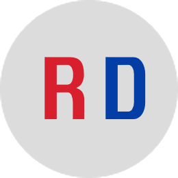

<!-- PROJECT LOGO -->
 

  

<h3 align="center">COSTCODLE</h3>

  

    A fork from <a href="https://github.com/KermWasTaken/costcodle"> as a  Wordle-esque daily guessing game for Rema food products!
  

<!-- ABOUT THE PROJECT -->
## About The Project

Guess the REMADLE in 6 tries.

* Each guess must be a valid price.
* Incorrect guesses will help guide you to the target price.

If you guess within 5% of the target price, you win!

A new REMADLE is available every day!

(<a href="#readme-top">back to top</a>)

### Built With

* [![HTML][HTML5]][HTML-url]
* [![CSS][CSS3]][CSS-url]
* [![JS][JavaScript]][JavaScript-url]

(<a href="#readme-top">back to top</a>)

<!-- LICENSE -->
## License

Distributed under the MIT License. See `LICENSE.txt` for more information.

(<a href="#readme-top">back to top</a>)

<!-- ACKNOWLEDGMENTS -->
## Acknowledgments

This project would not have been possible without the fork from <a href ="https://github.com/KermWasTaken/costcodle">

(<a href="#readme-top">back to top</a>)

<!-- MARKDOWN LINKS & IMAGES -->
<!-- https://www.markdownguide.org/basic-syntax/#reference-style-links -->
[license-shield]: https://img.shields.io/github/license/KermWasTaken/costcodle.svg?style=for-the-badge
[license-url]: https://github.com/KermWasTaken/costcodle/blob/main/LICENSE
[linkedin-shield]: https://img.shields.io/badge/-LinkedIn-black.svg?style=for-the-badge&logo=linkedin&colorB=555
[linkedin-url]: https://linkedin.com/in/zacharykermitz
[product-screenshot]: assets/costcodle.png
[HTML5]: https://img.shields.io/badge/html5-%23E34F26.svg?style=for-the-badge&logo=html5&logoColor=white
[HTML-url]: https://en.wikipedia.org/wiki/HTML
[CSS3]: https://img.shields.io/badge/css3-%231572B6.svg?style=for-the-badge&logo=css3&logoColor=white
[CSS-url]: https://en.wikipedia.org/wiki/CSS
[JavaScript]: https://img.shields.io/badge/javascript-%23323330.svg?style=for-the-badge&logo=javascript&logoColor=%23F7DF1E
[JavaScript-url]: https://en.wikipedia.org/wiki/JavaScript
